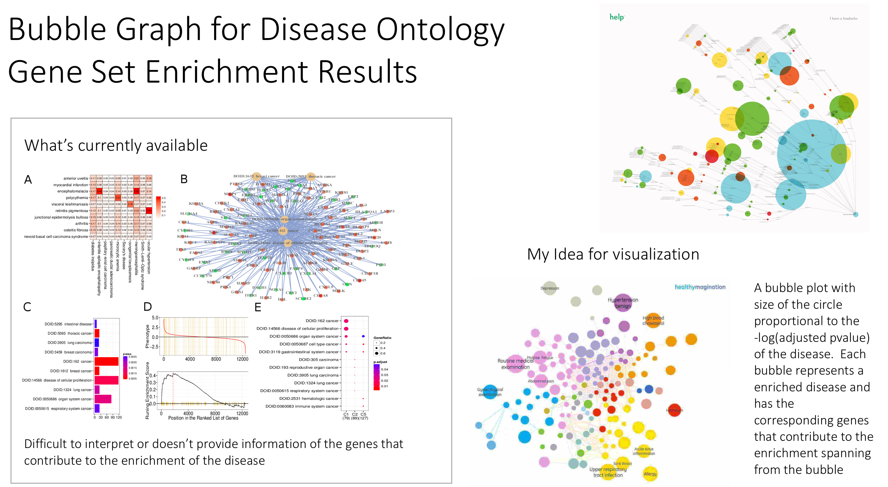
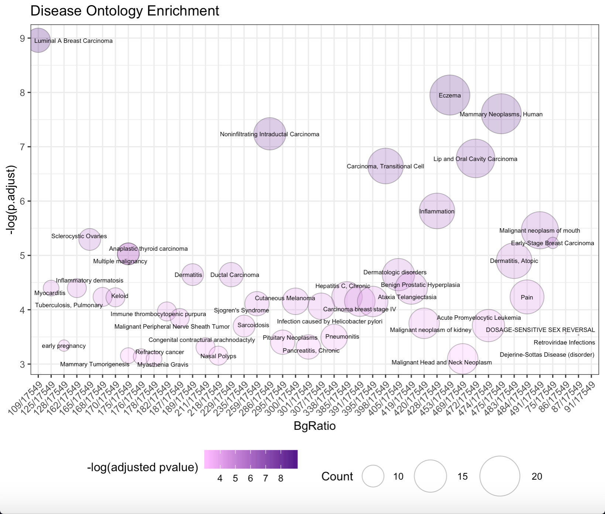

# `BubbleEnrich`

&nbsp;

###### [Yeon Joo Cha](https://orcid.org/0000-0003-4609-4965)


<!-- TOCbelow -->
1. About this package:<br/>
2. Installations<br/>
3. Overview<br/>
4. Contributions<br/>
5. Quick Demo<br/>
6. Things to do:<br/>

<!-- TOCabove -->

----


# 1 About this package:

This package creates a bubble graph of disease phenotypes from a gene enrichment analysis done on a gene set of interest.

&nbsp;

----

# 2 Installations 


```{r}
require("devtools")
install_github("CathyCha/BubbleEnrich")
library("BubbleEnrich")
```

----

# 3 Overview


Quick visualization of what the idea of the visualization of the package is: 


 


&nbsp;


# 4 Contributions

The author of this package is Yeon Joo (Cathy) Cha. The function available in this package is: 

```{r}
library("BubbleEnrich")
lsf.str("package:BubbleEnrich")
```

* BubbleEnrich 


The function BubbleEnrich was authored by Yeon Joo Cha and makes use of the <code>enricher()</code> function from <code>clusterProfiler</code> package along with disease to gene annotations from DisGeNET to get enrichment results of the gene set of interest. It also makes use of the ggplot function and the ggrepel package to plot a bubble graph of the enrichment results.

&nbsp;


# 5 Quick Demo 


### About the data

##### The example data being used for demo

For gene set enrichment analysis, we need a ranked list of genes. DOSE provides an example dataset geneList which was derived from R package breastCancerMAINZ that contained 200 samples, including 29 samples in grade I, 136 samples in grade II and 35 samples in grade III.

We can load the sample data into R via:

```{r}
data(geneList, package="DOSE")
head(geneList)
```

&nbsp;


##### DisGeNET for gene-disease annotations

Using the disease to gene annotations from DisGeNET 

*Stored in <code>~/BubbleEnrich/data/disgeneAnnot.rda</code>

http://www.disgenet.org/static/disgenet_ap1/files/downloads/all_gene_disease_associations.tsv.gz

```{r}
> disgeneAnnot <- load("~/BubbleEnrich/data/disgeneAnnot.rda")
> head(disgeneAnnot)
  geneId geneSymbol   DSI   DPI diseaseId                   diseaseName diseaseType diseaseClass
1      1       A1BG 0.857 0.172  C0019209                  Hepatomegaly   phenotype      C06;C23
2      1       A1BG 0.857 0.172  C0013080                 Down Syndrome     disease      C10;C16
3      1       A1BG 0.857 0.172  C0036341                 Schizophrenia     disease          F03
4      1       A1BG 0.857 0.172  C0001418                Adenocarcinoma       group          C04
5      1       A1BG 0.857 0.172  C0002736 Amyotrophic Lateral Sclerosis     disease      C10;C18
6      1       A1BG 0.857 0.172  C0017636                  Glioblastoma     disease          C04
               diseaseSemanticType score EI YearInitial YearFinal     pmid    source
1                          Finding  0.30 NA        2017      2017 28108177 CTD_human
2              Disease or Syndrome  0.01  1        2011      2011 21360684    BEFREE
3 Mental or Behavioral Dysfunction  0.30 NA        2015      2015 25821032 CTD_human
4               Neoplastic Process  0.01 NA        2008      2008 18706098     LHGDN
5              Disease or Syndrome  0.01  1        2009      2009 18973555    BEFREE
6               Neoplastic Process  0.01  1        2014      2014 24096582    BEFREE
```


&nbsp;


### Using your own data 

Suppose you are importing your own data from a csv file and the file contains two columns, one for gene ID (no duplicated allowed) and another one for fold change, you can prepare your own geneList with the lines below:

```{r}
d <- read.csv(your_csv_file)

##numeric vector
geneList <- d[,2]

##named vector
names(geneList) <- as.character(d[,1])

##decreasing order
geneList <- sort(geneList, decreasing = TRUE)

##we define fold change greater than 2 as differently expressed genes (DEGs)
geneList <- names(geneList)[abs(geneList) > 2]
```

&nbsp;

### Visualizations 


Running the demo with the example data from above...


```{r}
data(geneList)
BubbleEnrich(geneList)
```

... returns the following visualization 





This is a work-in-progress and will be cleaned up. 


# 6 Things to do: 

* clean up the contributing genes 

* implement in R shiny so that it can funtion as an interactive application
    * where user can input their own geneList of interest 
    * change colour 
    * axis of interest 
    * range of pvalue considered important 

&nbsp;


# 7 Acknowledgement

Enrichment functions from the clusterProfiler package in bioconductor was used to perform the enrichment analysis and output a enriched set result for the plotting of the bubble graph.

 
Acknowledgment to the DOSE package to for providing the example dataset for the demo of this package. 

Thank you to Professor Boris Steipe for providing a R package template, rpt (https://github.com/hyginn/rpt), for BCB coursework. 

&nbsp;

&nbsp;
<!-- END -->
