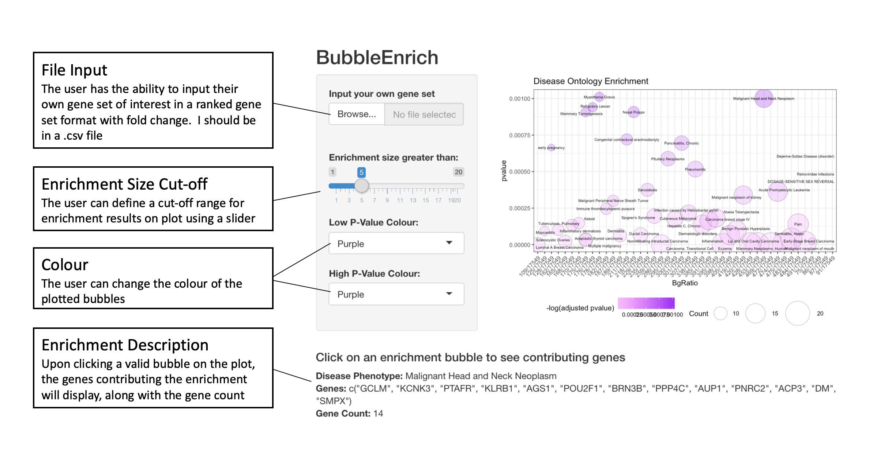

# `BubbleEnrich`

&nbsp;

###### [Yeon Joo Cha](https://orcid.org/0000-0003-4609-4965)


<!-- TOCbelow -->
1. About this package:<br/>
2. Installations<br/>
3. Overview<br/>
4. Contributions<br/>
5. Quick Demo<br/>
6. Things to do:<br/>
7. Acknowledgement<br/>

<!-- TOCabove -->

----


# Description

This package creates a bubble graph of disease phenotypes from a gene enrichment analysis done on a gene set of interest.

&nbsp;

----

# Installation


```{r}
require("devtools")
install_github("CathyCha/BubbleEnrich")
library("BubbleEnrich")
```

----

# Overview


Quick visualization of what the idea of the visualization of the package is: 


 

```{r}
 --BubbleEnrich/
   |__.gitignore
   |__.Rbuildignore
   |__.Rhistory
   |__BubbleEnrich.Rproj
   |__data/
      |__disgeneAnnot.rda
      |__HGNCAnnot.rda
   |__DESCRIPTION
   |__inst/
      |__CITATION
      |__extdata/
         |__CHA_Y_A1.png
         |__Rplot.png
         |__shiny.png
      |__shiny-scripts/
         |__app.R
   |__LICENSE
   |__LICENSE.md
   |__man/
      |__BubbleEnrich.Rd
      |__BubbleEnrichShiny.Rd
      |__disgeneAnnot.Rd
      |__geneIDsort.Rd
      |__HGNCAnnot.Rd
      |__userInput.Rd
   |__NAMESPACE
   |__R/
      |__BubbleEnrich.R
      |__BubbleEnrichShiny.R
      |__colourInput.R
      |__data.R
      |__geneIDsort.R
      |__sysdata.rda
      |__userInput.R
   |__README.md
   |__tests/
      |__testthat.R
      |__testthat/
         |__test-BubbleEnrich.R
   |__vignettes/
      |__.gitignore
      |__IntroductionBubbleEnrich.Rmd
```

&nbsp;


# Contributions

The author of this package is Yeon Joo (Cathy) Cha. The function available in this package is: 

```{r}
library("BubbleEnrich")
lsf.str("package:BubbleEnrich")
```

* BubbleEnrich 


The function BubbleEnrich was authored by Yeon Joo Cha and makes use of the <code>enricher()</code> function from <code>clusterProfiler</code> package along with disease to gene annotations from DisGeNET to get disease phenotype enrichment results of the gene set of interest and HGNC gene id to HGNC symbol annotation. It also makes use of the ggplot function and the ggrepel package to plot a bubble graph of the enrichment results.

&nbsp;


# Quick Demo 


### About the data

##### The example data being used for demo

For gene set enrichment analysis, we need a ranked list of genes. DOSE provides an example dataset geneList which was derived from R package breastCancerMAINZ that contained 200 samples, including 29 samples in grade I, 136 samples in grade II and 35 samples in grade III.


&nbsp;

### Visualizations 


Running the demo with the example data as default opens a shiny application...


```{r}
BubbleEnrichShiny()
```

... with the following default visualization 





##### DisGeNET for gene-disease annotations

Using the disease to gene annotations from DisGeNET 

*Stored in <code>~/BubbleEnrich/data/disgeneAnnot.rda</code>

http://www.disgenet.org/static/disgenet_ap1/files/downloads/all_gene_disease_associations.tsv.gz


```{r}
> head(disgeneAnnot)
  diseaseId geneId                   diseaseName
1  C0019209      1                  Hepatomegaly
2  C0013080      1                 Down Syndrome
3  C0036341      1                 Schizophrenia
4  C0001418      1                Adenocarcinoma
5  C0002736      1 Amyotrophic Lateral Sclerosis
6  C0017636      1                  Glioblastoma
```

&nbsp;

##### HGNC for geneID to HGNC symbol annotations

Using the HGNC annotation data to map geneIDs from clusterProfiler to more reader friendly HGNC symbols. 

https://www.genenames.org/cgi-bin/download/custom?col=gd_hgnc_id&col=gd_app_sym&col=gd_app_name&col=gd_status&col=gd_prev_sym&col=gd_aliases&col=gd_pub_chrom_map&col=gd_pub_acc_ids&col=gd_pub_refseq_ids&col=md_eg_id&status=Approved&status=Entry%20Withdrawn&hgnc_dbtag=on&order_by=gd_app_sym_sort&format=text&submit=submit

```{r}
> head(HGNCAnnot)
  HGNC.ID Approved.symbol
1       5            A1BG
2   37133        A1BG-AS1
3   24086            A1CF
4       6           A1S9T
5       7             A2M
6   27057         A2M-AS1
```

### Using your own data 

If you are using your own gene set, it should be numeric csv file. 


# References: 

&nbsp;


# Acknowledgement

Enrichment functions from the clusterProfiler package in bioconductor was used to perform the enrichment analysis and output a enriched set result for the plotting of the bubble graph.

 
Acknowledgment to the DOSE package to for providing the example dataset for the demo of this package. 

Thank you to Professor Boris Steipe for providing a R package template, rpt (https://github.com/hyginn/rpt), for BCB coursework. 

&nbsp;

&nbsp;
<!-- END -->
